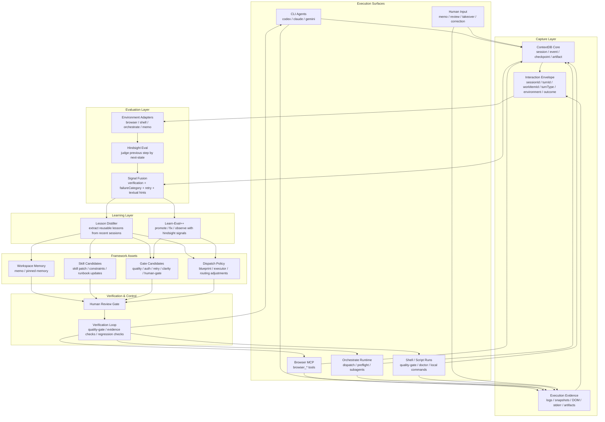

# AIOS Learning Loop Architecture

> 这是基于 `OpenClaw-RL` 分析后，为 `aios` 提出的目标架构图。
> 核心思想不是在线训练模型权重，而是在线强化 `skills / memory / gates / dispatch policy`。

## High-Level Diagram

## Read Path

1. Execution surfaces keep working normally; no training loop blocks the user path.
2. Every meaningful action is captured into `ContextDB + Interaction Envelope + Evidence`.
3. `Hindsight Eval` uses the next state to judge the previous step.
4. `Signal Fusion` combines structured telemetry with natural-language correction signals.
5. `Lesson Distiller` and `Learn-Eval++` turn repeated evidence into framework improvements.
6. Proposed changes flow through review and verification before being fed back into runtime behavior.

## Component Intent

- `Interaction Envelope`
  - Standardize turn-level learning metadata.
  - Distinguish `main` vs `side` vs `verification` vs maintenance turns.

- `Environment Adapters`
  - Avoid one giant evaluator.
  - Let browser, shell, orchestrate, and memo domains emit different hindsight signals.

- `Hindsight Eval`
  - Evaluate step `t` from the feedback arriving at `t+1`.
  - Produce `success / correction / retry-needed / ambiguous` plus hints and confidence.

- `Lesson Distiller`
  - Convert repeated failures or strong corrections into reusable framework assets.

- `Framework Assets`
  - Strengthen the system by updating memory, skills, gates, and dispatch policy.

## Phase Mapping

- Phase 1
  - `Interaction Envelope`
  - turn/work-item linkage in `ContextDB` and harness artifacts

- Phase 2
  - `Hindsight Eval`
  - `Signal Fusion`
  - `Learn-Eval++`

- Phase 3
  - `Lesson Distiller`
  - review-gated promotion into `memo / skills / gates / dispatch policy`
